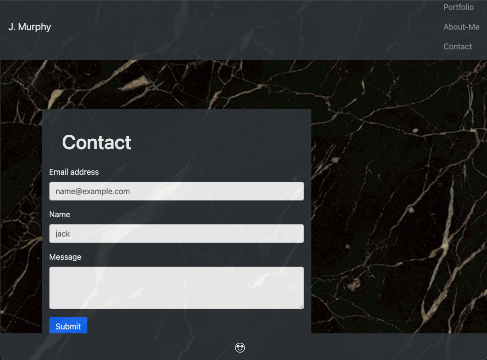
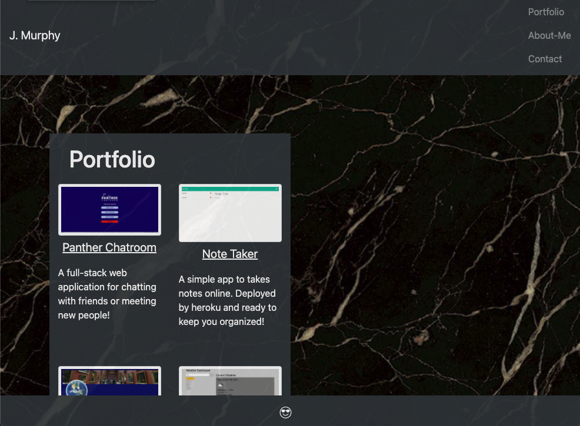

# Updated porfolio 2

# Table of Contents

- [Author](##Author)
- [Project Description](##Description)
- [Install](##Install)
- [Usage](##Usage)
- [Testing](##Testing)
- [License](##License)
- [Contributors](##Contributors)
- [Questions](##Questions)

## Author

Name: Jack
GitHub: jmurphy0

## Description

A simple page about me!

## Install

none

## Usage

view in browser
gitHub repo: https://github.com/jmurphy0/updated-porfoio-2.git

## Testing

N/A

## License

License:   
 License link: https://opensource.org/licenses/MIT

## Contributors

N/A

## Questions

N/A

